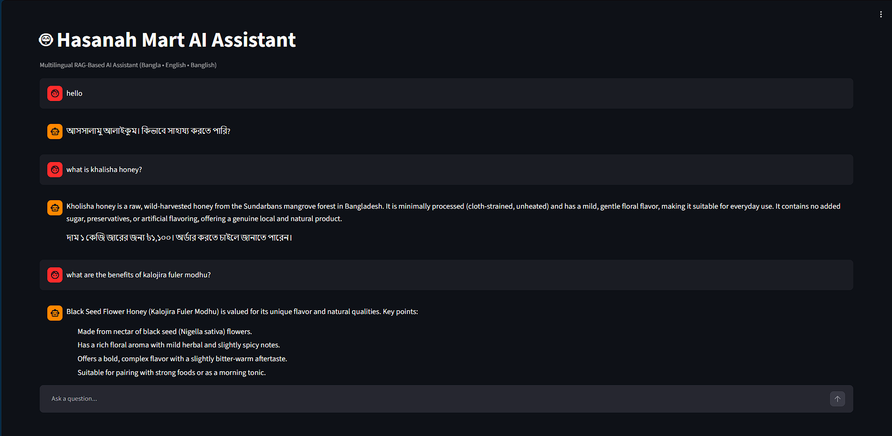
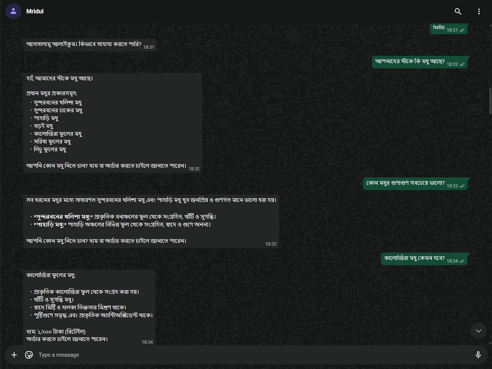

# RAG-Based-AI-Assistant-from-Scratch

A production-style multilingual Retrieval-Augmented Generation (RAG) system built entirely from scratch using Python, FastAPI, OpenAI Embeddings, FAISS, PostgreSQL, and WhatsApp Cloud API.

This project demonstrates the complete lifecycle of designing, building, evaluating, and deploying an AI assistant without relying on high-level RAG frameworks. Every major component—from knowledge base architecture and ingestion pipelines to retrieval, generation, API services, and WhatsApp integration—was designed and implemented manually to gain a deep understanding of production AI systems.

## Live Demo

🚀 Frontend:
https://rag-based-ai-assistant-streamlit.onrender.com

🔗 Backend API:
https://ecommerce-ai-assistant-rvqu.onrender.com

📄 API Docs:
https://ecommerce-ai-assistant-rvqu.onrender.com/docs

## Try These Questions and More

- What is Kholisha Honey?
- What are the benefits of Kalojira Flower Honey?
- How should honey be stored?
- Which honey is best for daily consumption?

---

## Screenshots

### Streamlit Web Interface

The Streamlit frontend provides a user-friendly chat experience powered by the RAG pipeline and FastAPI backend.



---

### WhatsApp AI Assistant

The assistant is also accessible through WhatsApp Cloud API, enabling customers to interact with the knowledge base directly from WhatsApp.



## Project Goals

* Build a complete RAG system from scratch
* Support multilingual retrieval (Bangla, English, Banglish)
* Design a scalable knowledge base architecture
* Implement semantic retrieval using vector search
* Support incremental indexing workflows
* Provide API and WhatsApp interfaces
* Follow production-oriented engineering practices
* Serve as a portfolio-quality AI Engineering project

---

## Key Highlights

### Custom RAG Pipeline

Built every major RAG component manually:

* Knowledge Base Design
* Metadata Enrichment Pipeline
* Schema Validation
* Markdown Parsing
* Semantic Chunking
* Embedding Pipeline
* Vector Store Management
* Retrieval Pipeline
* Prompt Construction
* Answer Generation
* API Layer
* WhatsApp Integration

No LangChain, LlamaIndex, CrewAI, or other orchestration frameworks were used for the core RAG implementation.

---

### Multilingual Knowledge Base

Supports:

* Bangla
* English
* Banglish

Knowledge is organized using a canonical product structure with schema-driven metadata.

---

### Metadata-Aware Retrieval

Each chunk contains:

* Product metadata
* Category metadata
* Retrieval priority
* Tags
* Aliases
* Visibility controls
* Semantic section information

This enables richer retrieval and future hybrid-search capabilities.

---

### Incremental Indexing Architecture

Designed and implemented:

* Manifest management
* Content hashing
* Change detection
* Selective re-indexing

Avoids rebuilding the entire vector database when only a subset of products changes.

---

## Dataset Statistics

| Metric             | Value                     |
| ------------------ | ------------------------- |
| Products           | 38                        |
| Markdown Documents | 418+                      |
| Semantic Chunks    | 1,135                     |
| Embeddings         | 1,135                     |
| Languages          | Bangla, English, Banglish |
| Embedding Model    | text-embedding-3-small    |
| Vector Database    | FAISS                     |

---

## Technology Stack

### AI & Retrieval

* OpenAI Embeddings
* FAISS
* Custom Retrieval Pipeline

### Backend

* Python
* FastAPI
* Pydantic

### Database

* PostgreSQL
* SQLAlchemy

### Integrations

* WhatsApp Cloud API

### Development

* Git
* Virtual Environments
* Modular Package Architecture

---

## System Architecture

```text
Knowledge Base
        │
        ▼
KB Validator
        │
        ▼
Markdown Loader
        │
        ▼
Metadata Loader
        │
        ▼
Markdown Parser
        │
        ▼
Text Normalizer
        │
        ▼
Semantic Chunker
        │
        ▼
Embedding Pipeline
        │
        ▼
FAISS Vector Store
        │
        ▼
Retrieval Pipeline
        │
        ▼
Prompt Builder
        │
        ▼
Answer Generator
        │
        ▼
FastAPI Service
        │
        ▼
WhatsApp Interface
```

---

## Knowledge Base Architecture

Each product follows a canonical structure:

```text
product/
│
├── product.yaml
├── overview.md
├── benefits.md
├── nutrition.md
├── sourcing.md
├── authenticity.md
├── usage.md
├── storage.md
├── faq.md
├── warnings.md
├── comparisons.md
├── pricing.md
├── shipping.md
├── aliases.md
│
├── qa/
├── media/
└── translations/
```

This structure enables:

* Consistent ingestion
* Metadata enrichment
* Reliable chunking
* Better retrieval quality
* Easier maintenance

---

## Ingestion Pipeline

The ingestion system transforms raw markdown documents into retrieval-ready chunks.

### Components

* KB Validator
* Schema Validator
* Markdown Loader
* Product Metadata Loader
* Markdown Parser
* Text Normalizer
* Semantic Chunker
* Artifact Writer

### Generated Artifacts

```text
artifacts/
├── parsed/
├── normalized/
├── chunked/
├── embeddings/
├── faiss/
└── pipeline_logs/
```

---

## Retrieval Pipeline

Implemented retrieval system components:

* FAISS Similarity Search
* Metadata-Aware Retrieval
* Query Processing
* Retrieval Pipeline Orchestration

Chunk metadata includes:

* Product ID
* Category
* Source File
* Section Information
* Retrieval Priority
* Tags
* Aliases

---

## Answer Generation

The generation layer includes:

* Prompt Builder
* System Prompt Design
* Context Assembly
* Answer Generator

The assistant generates grounded responses based exclusively on retrieved knowledge base content.

---

## API Layer

Built using FastAPI.

### Core Services

```text
api/
├── services/
│   ├── rag_service.py
│   ├── conversation_service.py
│   ├── query_rewriter_service.py
│   └── whatsapp_service.py
│
├── repositories/
├── routers/
├── schemas/
└── database/
```

### Features

* Chat Endpoint
* Conversation Persistence
* Query Rewriting
* Retrieval-Augmented Generation
* WhatsApp Integration

---

## Engineering Decisions

### Retrieval-First Design

The project prioritizes retrieval quality before generation quality.

### Schema-Driven Architecture

Validation is performed using dedicated schemas:

* Product Schema
* Chunk Schema
* Metadata Schema
* Retrieval Schema

### Semantic Chunking

Chunking preserves:

* Heading hierarchy
* Semantic sections
* Tables
* Multilingual content

### Observability

Every ingestion stage generates inspectable artifacts for debugging and evaluation.

---

## Example Use Cases

* E-commerce Product Assistant
* Customer Support Agent
* WhatsApp AI Assistant
* Internal Knowledge Base Assistant
* FAQ Automation
* Product Recommendation System

---

## Production Readiness

The system has been tested as a production-capable architecture for an e-commerce knowledge base.

Current deployment is limited by OpenAI API usage costs rather than technical constraints.

The architecture supports:

* API-based serving
* WhatsApp integration
* Persistent conversations
* Incremental updates
* Scalable knowledge base growth

---

## What I Learned

This project was built as an AI Engineering learning journey focused on understanding every layer of a production RAG system.

Key areas explored:

* Knowledge Base Engineering
* Retrieval System Design
* Embedding Pipelines
* Vector Databases
* Metadata Enrichment
* Incremental Indexing
* Prompt Engineering
* FastAPI Backend Development
* Database Design
* WhatsApp Integration
* Production AI System Architecture

---

## Future Improvements

* Hybrid Search (Vector + Keyword)
* Retrieval Re-ranking
* Automated Evaluation Pipeline
* Multi-Vector Retrieval
* Agentic Workflows
* Local Embedding Models
* Multi-Tenant Knowledge Bases
* Analytics Dashboard
* CI/CD and Containerized Deployment

---
